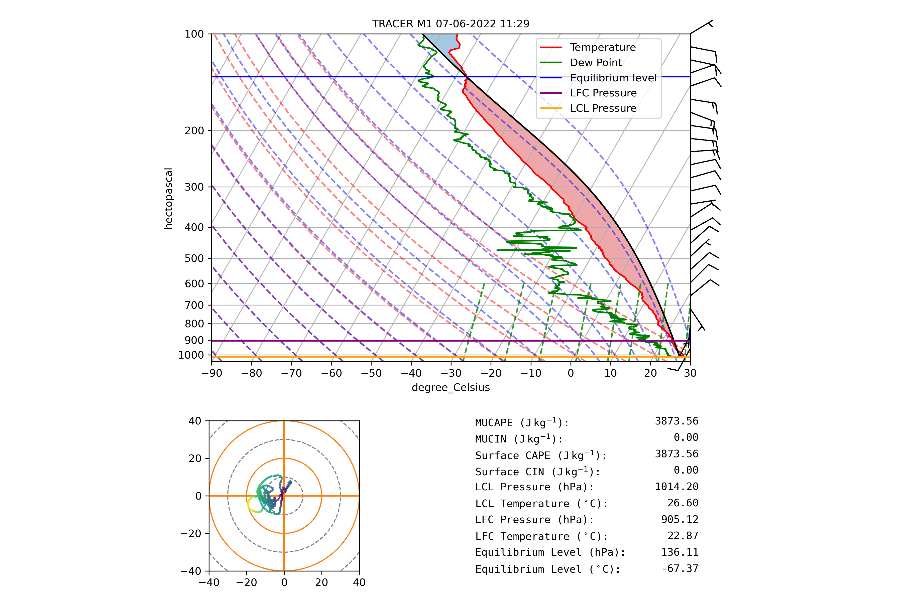
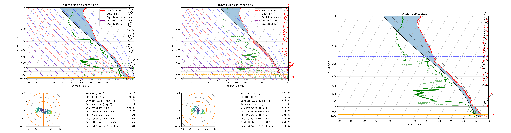

# **Radiosonde Intercomparison Project**

## **Project Overview**
This project processes and visualizes data from two types of radiosonde launches:
- **Sonde** – TRACER ozonesonde data files
- **M1** – TRACER M1 radiosonde data files

The primary goal is to compare the measurements from these two sources and analyze whether there are any systematic biases between them.

## **Motivation**
Radiosonde data is crucial for understanding atmospheric conditions, including temperature, humidity, wind, and pressure. By comparing data from sonde and M1 radiosondes, this project aims to identify any discrepancies or biases, which could improve the accuracy of future atmospheric measurements.

## **How It Works**
### **1. Sonde Data Processing**
- `sonde.py` reads sonde data files, processes the data, and generates Skew-T diagrams, Hodographs, and statistics showing temperature, dew point, and wind profiles. There are two SkewTs from the same day (1100 UTC and 1500UTC)
- Data is filtered and cleaned to remove missing or flagged values.


### **2. M1 Data Processing**
- `skewt_hodo_stats.py` will follow a similar structure to `sonde.py` to process M1 data files but for 1130 UTC and 1730UTC.


### **3. Combined Plotting**
- `sonde_combiner.py` reads and processes data from the sonde files again with matching dates and creates combined Skew-T plots for side-by-side comparison. This process is carried within the `skewt_hodo_stats.py` for M1 files.
- Pressure consistency is verified, and parcel paths, CAPE, CIN, and LCL/LFC/EL pressures are calculated.


### **4. Three-Grid Visualization**
- `sonde_image_combiner.py` combines individual sonde and combined plots into a single three-panel grid.
-  `image_combiner.py` combines individual M1 and combined plots into a single three-panel grid.


## **Goals**
- Generate consistent Skew-T plots from both sonde and M1 radiosonde data  
- Create combined plots for intercomparison  
- Identify and analyze any systematic biases between the two data sources  

## **Setup**
### **1. Create Virtual Environment**
```bash
conda create -n radiosonde_env python=3.10
conda activate radiosonde_env
```

### **2. Install Dependencies**
```bash
pip install -r requirements.txt
```

### **3. Run Processing Scripts**
- Process sonde data:
```bash
python sonde.py
```
- Process M1 data:
```bash
python m1.py
```
- Generate combined plots:
```bash
python sonde_combiner.py
```
- Create three-grid visualizations:
```bash
python sonde_image_combiner.py
```

## **Requirements**
- Python 3.10
- Required packages (see `requirements.txt`)
  - `metpy`
  - `numpy`
  - `pandas`
  - `matplotlib`
  - `Pillow`
